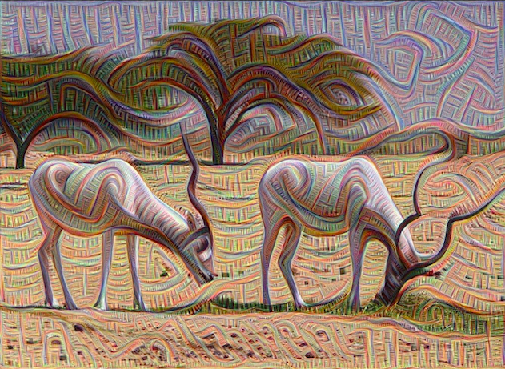
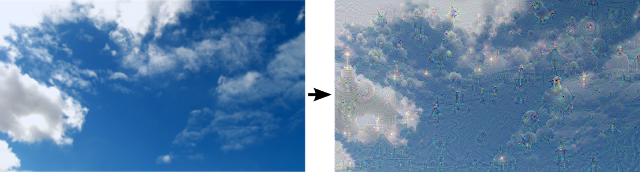
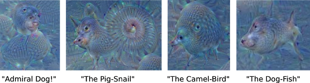

DeepDream is one of the coolest applications of machine learning - it started out at Google as an effort to gain more insights into the blackbox of neural networks but surprisingly ended up making some wonderful abstract, psychedelic art. Although DeepDream is a few years old now, most articles on the subject have failed to give a satisfactory explanation of how exactly DeepDream works in an understandable manner - I will make another attempt now.

What is DeepDream

Basically, DeepDream takes an image as an input (e.g. a picture of the cloudy sky) and then outputs a dreamy image that looks like hallucinations (e.g. a cloudy sky with various funny patterns).

(Image Source: https://ai.googleblog.com/2015/06/inceptionism-going-deeper-into-neural.html)

The core idea is a beautiful and simple one. You just ask the neural network “what patterns do you see in this image? Now amplify it.”

In the section below I will explain the technical details of this idea in-depth.

How Does DeepDream Work?

Neural Network

To understand deep dream, we need to understand neural networks first, because in some sense, deep dream is just the reverse of neural networks. You can safely skip this section if you already understand neural networks.

Now, different keywords related to neural networks have hijacked the media spotlight for the past few years: deep learning (neural networks with a lot of layers), convolutional neural networks, recurrent neural networks etc. However, all types of neural networks all boil down to one quintessential model, as a machine learning architecture inspired by the connectivity of neurons in the human brain.

Here is what a vanilla neural network looks like:

This neural work can be trained to perform a variety of tasks but in this article, we are going to use the example of image classification, in which case, you input an image of an object and the network outputs a class (what the network think the object is, such as dogs, cars, dumbbells etc.)
There is a lot of math underlying neural networks which we will not go into, but when you execute a trained neural network to classify an image, here is what is going on:

1. Pixels from the input image enter via the input layer. In the illustration above, think of each of those yellow neurons as a pixel from the input image. (Of course in reality there will be more than 3 pixels for each image)
2. Hidden layer 1 takes a look at the pixels and detect certain features from them (such as edges, curves) and pass those features on to hidden layer 2, which would extract certain features on top of those edges and curves (such as circles, triangles), and so on, with each hidden layer extracting more abstract features based on the previous abstractions.
3. Finally, based on the abstractions extracted by the last hidden layer, the output layer makes a guess about what the object is.

As a simplified example, let’s say we input an image of a snake, if the hidden layer 1says "ah I see some edges and some curves", the hidden layer 2 might say “ah I see a triangle and two circles from those curves and edges”, then the hidden layer 3 may say “oh, the two circles are actually two eyes and the triangle is a head”, and eventually the output layer may decide that it is the head of a snake.

(Image from Google image search, illustrating the abstraction that occurs when an image is passed through each layer of the neural network)

Although this gives a general idea of what goes on when an image goes through each layer of a neural network, the truth is, even the top researchers around the world do not yet understand what exactly goes on in each of the neurons in a neural network. As an effort to peek into this blackbox of neural network, a team at Google designed a technique called Inceptionism, also known as DeepDream, which I explain below. See the original blog post here.

DeepDream

As I stated earlier in this article, the core idea of DeepDream is to ask the network “what patterns do you see in the image, now amplify it.” In practice, this means that you try to maximize the activation functions of a certain layer or neuron by changing the input picture.
Recall that different layers represent different levels of abstractions. The bigger the activation functions of a certain layer, the more pronounced those abstractions will appear in the final image.
For example, let’s take a look at this image below:

(Image from https://deepdreamgenerator.com)

When given the original input image of a bird, the neural network tries to identify different patterns in the image in order to determine what the image is - let’s say the activation functions of layer 2 of the neural network may see like 0.2 edges, while activation functions of layer 3 may see 0.4 circles in the image etc.

Now, to perform a DeepDream iteration, you choose a layer - let’s say layer 2 - and maximize its activation functions (via gradient ascent), effectively telling the computer “I want more than 0.2 edges! Change the image, give me 0.3 edges!” The computer then will alter the image to make the edges more pronounced, rendering the middle image.

If you want more circles for your image, you can perform the gradient ascent to maximize layer 3 of the neural network by altering the image, rendering the right image.
Depending how you want your final image to be, you maximize different layers or even neurons of the network to emphasize different features.

This is a point of confusion for even some ML practitioners because we are using an image classification neural network, but not for its originally intended purpose.

While both image classification and DeepDream uses the same neural network, for image classification (the regular use), the input is an image and the output is a class, whereas for DeepDream, the input is an image and the output is a more psychedelic version of the image.

Whereas an optimization such as gradient descent is usually performed in order to train a better neural network, in DeepDream, we perform an optimization (maximizing a layer's activation functions via gradietn ascent) in order to get a cool image. In the former case we care about the neural network,so we alter the neural network based on the training images (image --> neural network), whereas in the latter case, we care about the final image, so we alter the image to produce a neural network with a certain layer maximized (neural network --> image).

Besides the cool psychedelic art it produces, DeepDream has actual utility - We can now peek into the blackbox of the neural network and debug. For example, the team at Google discovered via DeepDream that a neural network trained to recognize dumbbells manifested a lot of arms upon maximizing a certain layer, exposing the bias in the training data - that is, the training images probably contained too many photos of dumbbells when they are being lifted, so the model was not as good at recognizing dumbbells without an arm.

An Implementation of DeepDream

Here is a tutorial on implementing DeepDream that I used in case you are interested. I am attaching here the result of my modified implementation of DeepDream on the logo of Cortex Labs (my company, which seeks to decentralize AI on the blockchain), partly to show you what is possible with DeepDream and partly to show you how DeepDream also has practical use for business marketing ;)
The image below is a screenshot of the full video iteration, which you can view here. I had the neural network maximize the first hidden layer (edges) for 150 images (while keeping zooming in), then second hidden layer (circles) for the next 150 images and so on. I eventually strung these images together into a video using a Python script.

(As can be seen from the screenshot of the video, the lines and edges are very pronounced and the result is a cooler version of the original image)

Hope you have a clearer understanding of DeepDream now. Go make some cool arts yourself!
